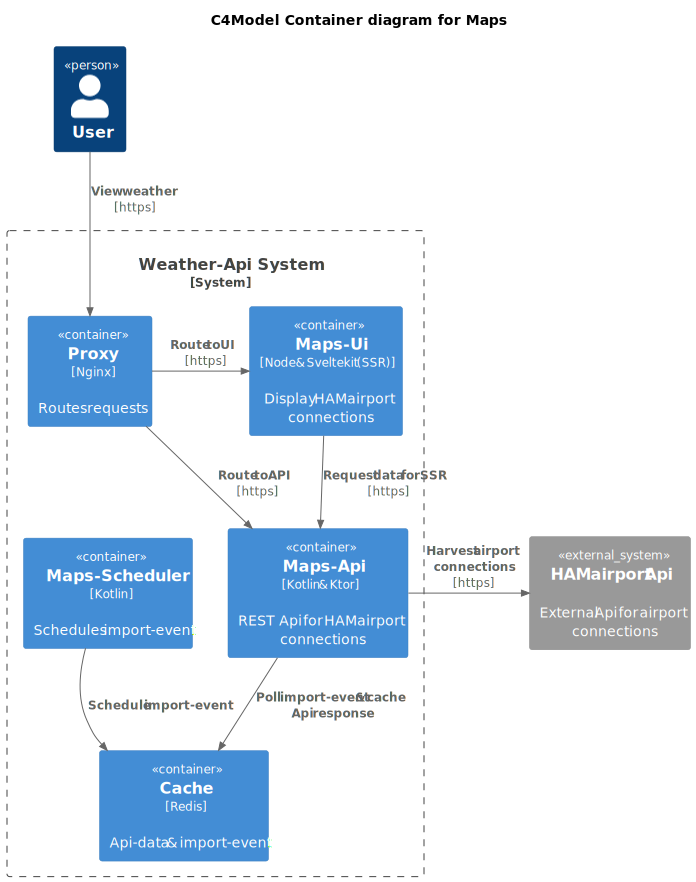

# maps


[](https://codecov.io/gh/OskarWestmeijer/maps)
[](https://uptime.betterstack.com/?utm_source=status_badge)

Displays Hamburg airport connections on a 3d globe. The backend provides a public Api.

- [https://maps.oskar-westmeijer.com](https://maps.oskar-westmeijer.com) (Sveltekit frontend)
- [https://api.maps.oskar-westmeijer.com](https://api.maps.oskar-westmeijer.com) (Ktor backend)

## Technologies

```
- Kotlin & Ktor
- Redis
- Typescript & Sveltekit
- GlobeJs, Tailwindcss & DaisyUI
```

## Build & Test

``` bash
docker compose up -d
./gradlew clean check
```

## How-to Run

Execute these commands and refer to the `frontend/README.md` for further instructions.

``` bash
docker compose up -d
./gradlew run
```

## Architecture



## Caching with Redis

To get insights into the running Redis cache use these commands. The commands focus on working with string types.

```
docker exec -it <docker-redis-cache-id> sh

# get list of cached keys, only show 10
redis-cli --scan | head -10

# get value for key
redis-cli GET test-key:2

# set value for key
redis-cli SET test-key:2 "yeeeah buddy"

# delete a key
redis-cli DEL test-key:2

# output content of set
redis-cli SMEMBERS refresh_routes

# pop random element from set
redis-cli SPOP refresh_routes
```
