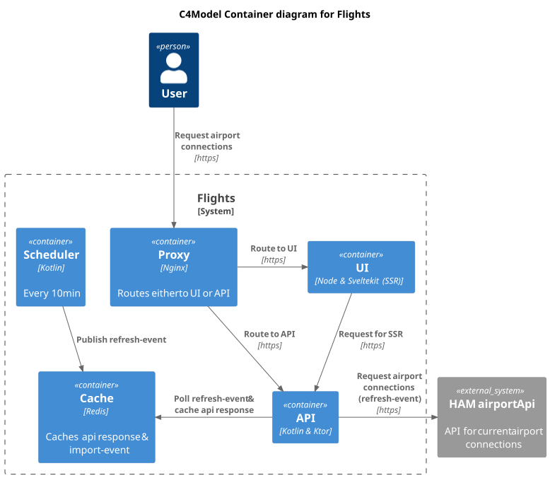

# Flights


[](https://codecov.io/gh/OskarWestmeijer/flights)
[](https://uptime.betterstack.com/?utm_source=status_badge)

Displays Hamburg airport connections on a 3d globe. The backend provides a public Api. The airport connections are refreshed every 10
minutes.

- [https://flights.oskar-westmeijer.com](https://flights.oskar-westmeijer.com) (Sveltekit frontend)
- [https://api.flights.oskar-westmeijer.com](https://api.flights.oskar-westmeijer.com) (Ktor backend)

## Technologies

```
- Kotlin & Ktor
- Redis
- Typescript, Sveltekit & Vite
- Vitest & Playwright
- GlobeJs, Tailwindcss & DaisyUI
```

## Build & Test

``` bash
docker compose up -d
./gradlew clean check
```

## How-to Run

Execute these commands and refer to the `frontend/README.md` for further instructions.

``` bash
docker compose up -d
KTOR_DEVELOPMENT=true ./gradlew run
```

## Deployment

Deploys are automated: every push to `main` runs `main-build-test-release.yml`, and once both
image-release jobs succeed its final `deploy` job calls the reusable `.github/workflows/deploy.yml`,
which SSHes to the host, `cd /deployments/flights && git pull`, and runs `./deploy.sh <image_tag>`.

The same workflow can be run manually (`workflow_dispatch`) to deploy or roll back by hand. Its
`image_tag` input defaults to `latest`; any `sha-<full-commit-sha>` tag pushed by
`docker/metadata-action` can be given instead (a bare 40-char SHA is normalised to `sha-<sha>` by
`deploy.sh`). It needs `SSH_HOST`, `SSH_USER` and `SSH_PRIVATE_KEY` in the
`oskar-westmeijer-environment` GitHub environment.

Production runs from `cprod.yml` (distinct from the dev `docker-compose.yml`, which only provides
Redis + Wiremock for local development). Both application images are pinned to
`${FLIGHTS_IMAGE_TAG:-latest}` there, which `deploy.sh` exports — that indirection is what makes a
tagged rollback possible, so keep the images referencing the variable rather than a hard-coded
`:latest`. `deploy.sh` tears down and recreates the containers from the prebuilt
`oskarwestmeijer/flights-api` / `flights-ui` images, restarts the `reverse-proxy` container
(recreated containers get new IPs on the `proxy` network and the proxy only resolves upstreams at
startup), then prunes the images the deploy orphaned.

## Architecture



## Caching with Redis

To get insights into the running Redis cache use these commands. The commands focus on working with string types.

```
docker exec -it <docker-redis-cache-id> sh

# get list of cached keys, only show 10
redis-cli --scan | head -10

# get value for key
redis-cli GET test-key:2

# set value for key
redis-cli SET test-key:2 "yeeeah buddy"

# delete a key
redis-cli DEL test-key:2

# output content of set
redis-cli SMEMBERS refresh_routes

# pop random element from set
redis-cli SPOP refresh_routes
```
